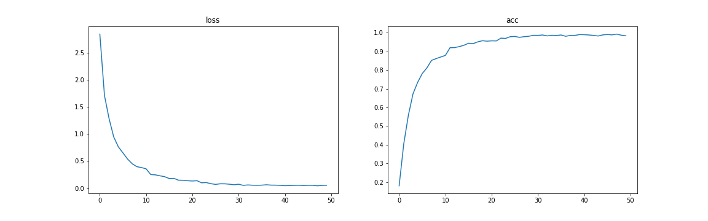
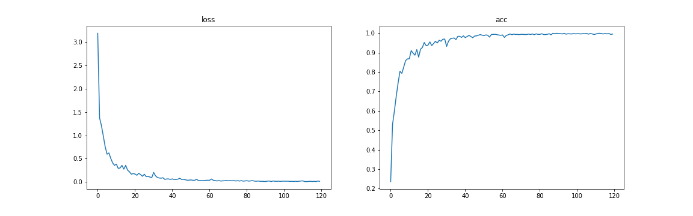
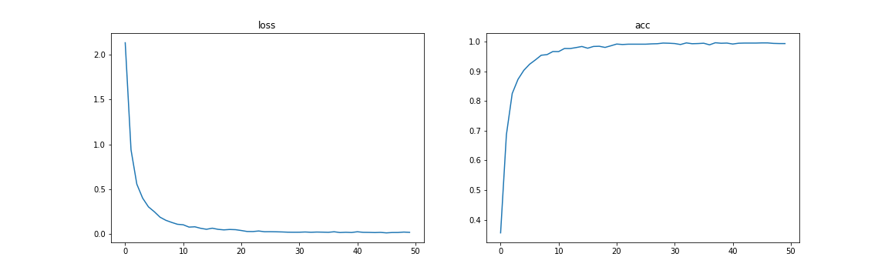
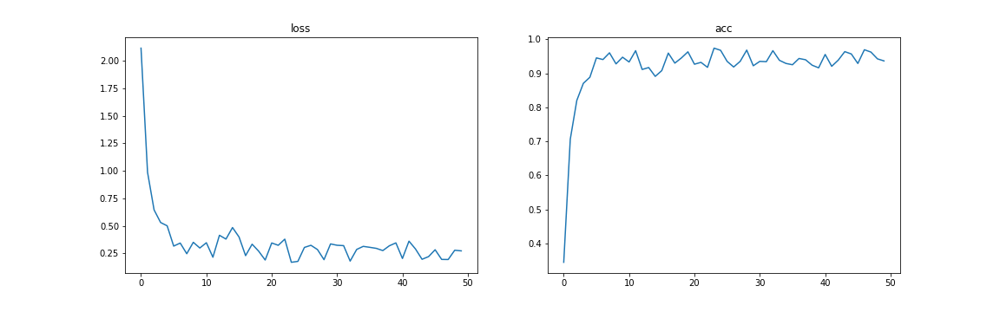
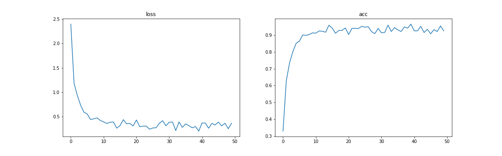

# paddle_seven_days - day2：手势识别

[notebook](./手势识别.ipynb)

## 1.说明
- 应用了图像增强包：albumentations (pip install albumentations)
- 基于resnet18 + 多种图像增强策略(flip, ricap, mixup, cutout)
- 图像大小 3 * 100 * 100
- batch_size 32
- 优化器 sgd, cosindecay, base_lr = 0.1 * (32 / 256)
> mixup 和 ricap 中的超参beta可以调整

## 结果展示

| model | data aug | acc |
| -------- | -------- | -------- |
| resnet18 | RANDOM FLIP     | 0.90575397  |
| resnet18 | RICAP     | 0.97172624  |
| resnet18 | CUTOUT     | 0.91914684  |
| resnet18 | MIXUP     | 0.88789684  |
| resnet18 | MIXUP + CUTOUT   | 0.9236111  |

### 1. random flip

### 2.ricap 

### 3.cutout

### 4.mixup 

### 5.mixup + cutout

