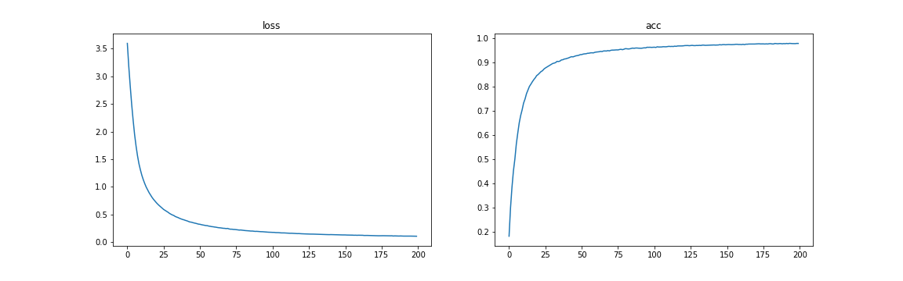
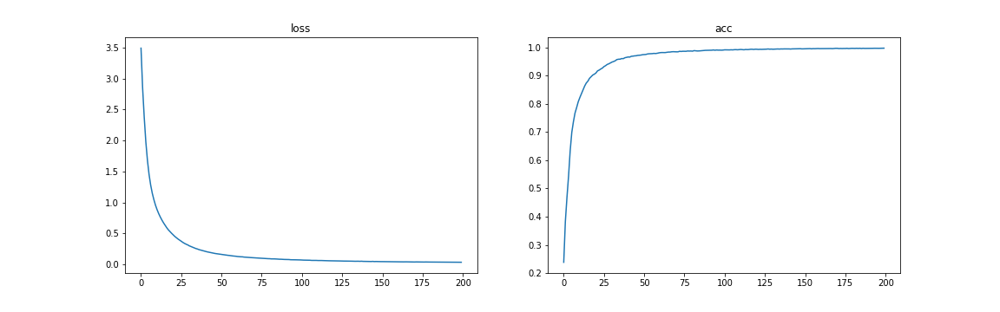
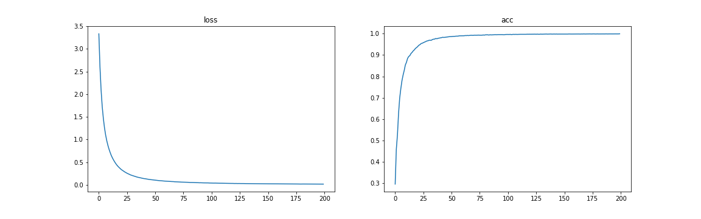
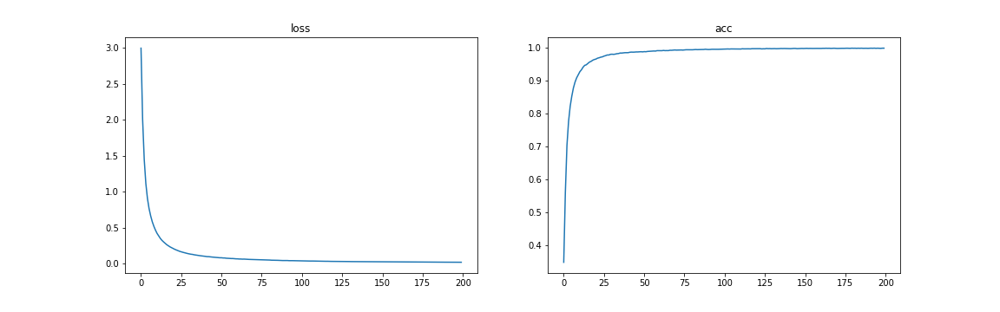
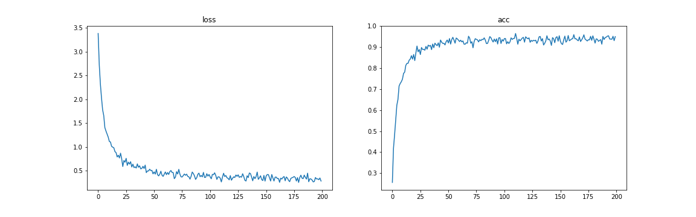
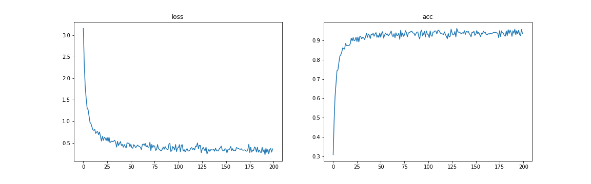

# paddle_seven_days - day3 : 车牌识别

## 1.实验结果
|(ch_out) | data aug | acc |
| -------- | -------- | -------- |
| 6 16 256 | None     | 0.97115386 |
| 16 32 256 | None     | 0.99038464 |
| 16 32 512 | None     | 0.9879808  |
| 32 64 256 | None     | 0.9933894  |
| 32 64 1024 | None     |0.98497593 |
| 32 64 256  | MIXUP     |0.99278843 |
| 32 64 1024 | MIXUP     |0.99158657 |

### 1.conv arch1: 6 16 256

### 2.conv arch2: 16 32 256

### 3.conv arch3: 16_32_512

### 4.conv arch4: 32_64_256

### 5.conv arch5: 32_64_1024

### 6.conv arch6: 32_64_256_mixup

### 7.conv arch7: 32_64_1024_mixup

